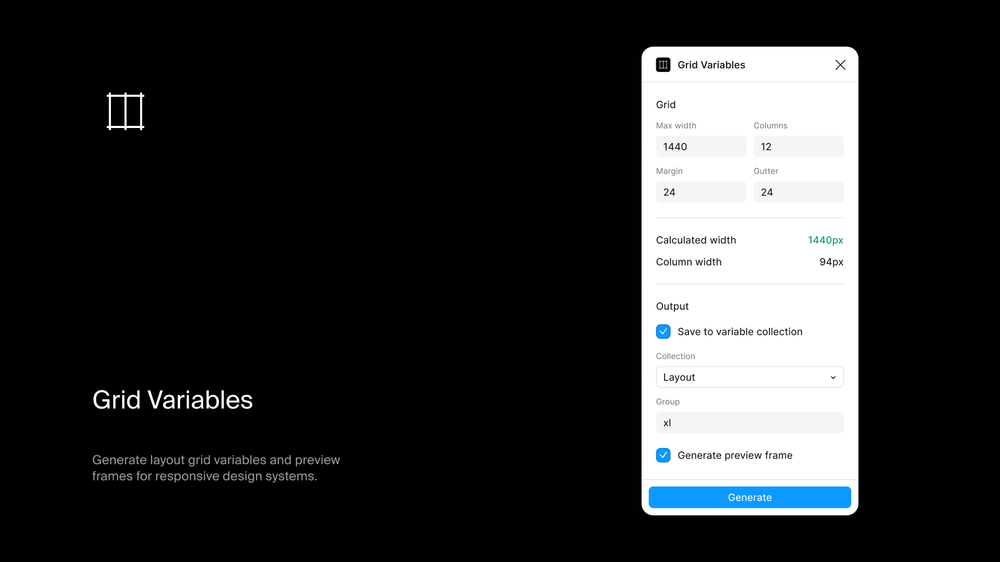

# Grid Variables

Generate layout grid variables and a preview frame from your grid settings.

## Install

Get it from the [Figma Community](https://www.figma.com/community/plugin/1547186853289230831/grid-variables)

## What it does

Calculates column widths from your grid parameters and creates Figma variables for viewport, columns, margins, gutters, and column spans. Optionally generates a preview frame with the grid bound to those variables.

The plugin automatically rounds column widths to whole pixels and shows whether your grid parameters result in pixel-perfect dimensions. The calculated width indicator turns green when your max width matches the rounded result, or red when rounding causes a mismatch.

## Usage

1. Run the plugin
2. Enter the max width, the number of columns, and the margin and gutter
3. Choose **Save to variable collection**, **Generate preview frame** or both. To save variables, pick a collection and enter a group name, such as `grid/xl`
4. Click **Generate**

For each screen and what its controls do, see the [user guide](https://figma-plugins.notion.site/Grid-Variables-3ecf29c09c9d81cab7d7d2997fe5a8fe).

## Output

**Variables** (grouped by your chosen name):
- `{group}/viewport` - Total width
- `{group}/columns` - Column count
- `{group}/margin` - Side margins
- `{group}/gutter` - Gap between columns
- `{group}/col-1` through `col-{n}` - Span widths for each column span

**Preview frame** - Named with the max width value (e.g., "1440"), with column layout and grid overlay bound to variables if generated together

## Development

```bash
npm install
npm run dev    # Watch mode
npm run build  # Production build
```
