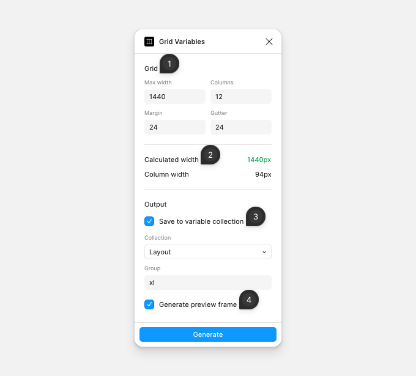

# Grid Variables

Grid Variables creates number variables and a preview frame from a column grid, for example `xl/col-3` for the width of three columns in a 1440px, 12-column layout. It rounds each column to whole pixels and shows whether the grid still matches the width you set.

## Generate a grid

1. **Grid** — the grid in pixels: **Max width**, the number of **Columns**, the **Margin** on each side and the **Gutter** between columns.
2. **Calculated width** — the width of the grid after the plugin rounds the **Column width** to whole pixels. It is green when it equals **Max width**, and red when the rounding changes the width. Change a value until it is green.
3. **Save to variable collection** — saves the grid in **Collection**, in a group named by **Group**: `xl/viewport` (the calculated width), `xl/columns`, `xl/margin`, `xl/gutter`, and `xl/col-1` to `xl/col-12` for the width of 1 to 12 columns.
4. **Generate preview frame** — draws a frame named `1440` with a column layout grid and one bar for each span, from 1 column to 12.

Click **Generate** to create the variables, the frame or both. Press Ctrl/Cmd+Z to undo.

The plugin sets the values in the collection's default mode. The `col-` variables apply only to width and height, and the other four don't appear in the variable pickers. When the group already exists, the plugin updates its variables and deletes every other variable in that group, such as `xl/col-13` from an earlier 16-column grid. With both options selected, the frame's width, padding, gap, layout grid and bars use the new variables.

**Generate** stays disabled until you select an option, and while the values leave no room for columns. When the file has no variable collection, **Collection** is disabled.
